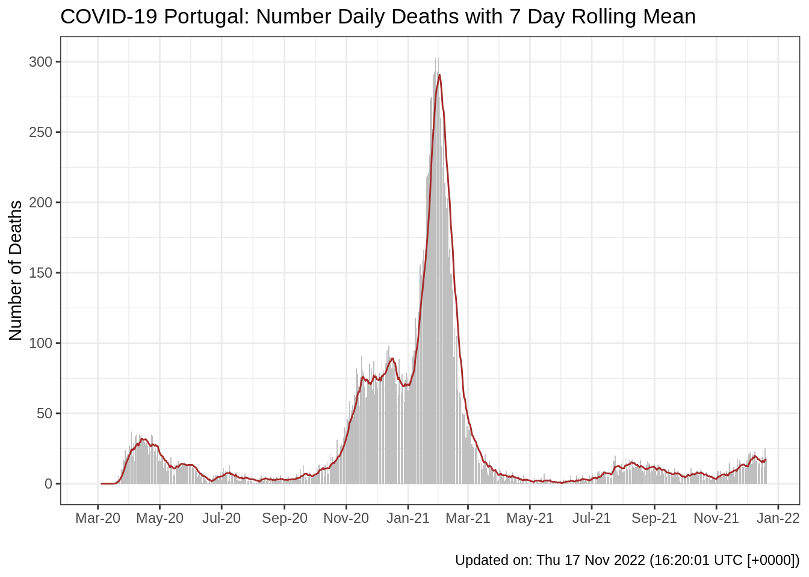

# Portuguese COVID-19 Data

**Last updated:** Wed 24 Jun 2020 (13:59:45 WEST \[+0100\])

## Data Meta Information

  - **Start date:** 2020-02-26
  - **End Date:** 2020-06-23
  - **Number of days:** 119

## Source

For more information about the data and variables see:
<https://github.com/dssg-pt/covid19pt-data>

The original data were downloaded from an API provide by VOST
<https://covid19-api.vost.pt/Requests/get_entry/>

## User Friendly version.

This repository intends to provide a user friendly CSV version of the
Portuguese COVID-19 data (updated daily - once automated). Download the
user friendly version from:

  - Cleaned and user friendly data:
    [covid19pt\_DSSG\_Long.csv](https://raw.githubusercontent.com/saghirb/Dados_COVID-19_PT/master/data/covid19pt_DSSG_Long.csv)
  - Original unprocessed data (json to CSV):
    [covid19pt\_DSSG\_Orig.csv](https://raw.githubusercontent.com/saghirb/Dados_COVID-19_PT/master/data/covid19pt_DSSG_Orig.csv)

# Example Usage

## Read in the data

Using the `data.table` package to process the data.

``` r
# Load Libraries
library(data.table)
# You can use use: library(here)
suppressPackageStartupMessages(library(here))
library(ggplot2)
library(magrittr)

# Change the ggplot theme.
theme_set(theme_bw())

# Read in data as a data.frame and data.table object.
CV <- fread(here("data", "covid19pt_DSSG_Long.csv"))
str(CV)
## Classes 'data.table' and 'data.frame':   9996 obs. of  12 variables:
##  $ data       : chr  "2020-02-26" "2020-02-27" "2020-02-28" "2020-02-29" ...
##  $ origVars   : chr  "cadeias_transmissao" "cadeias_transmissao" "cadeias_transmissao" "cadeias_transmissao" ...
##  $ origType   : chr  "cadeias" "cadeias" "cadeias" "cadeias" ...
##  $ sex        : chr  "All" "All" "All" "All" ...
##  $ ageGrpLower: chr  "" "" "" "" ...
##  $ ageGrpUpper: chr  "" "" "" "" ...
##  $ ageGrp     : chr  "" "" "" "" ...
##  $ region     : chr  "Portugal" "Portugal" "Portugal" "Portugal" ...
##  $ symptoms   : chr  "" "" "" "" ...
##  $ other      : chr  "cadeias_transmissao" "cadeias_transmissao" "cadeias_transmissao" "cadeias_transmissao" ...
##  $ value      : num  NA NA NA NA NA NA NA NA NA 5 ...
##  $ valueUnits : chr  "" "" "" "" ...
##  - attr(*, ".internal.selfref")=<externalptr>

# Order data by original variable name and date.
setkeyv(CV, c("origVars", "data"))

# Convert data to a data object in dataset and add a chage from previous day variable.
CV[, data := as.Date(data, format = "%Y-%m-%d")][
  , dayChange := value - shift(value, n=1, fill=NA, type="lag"), by = origVars][
  grepl("^sintomas", origVars), dayChange := NA]
```

## Overall Number of Deaths (daily) by Sex

``` r
CV[origType=="obitos" & sex %in% c("F", "M") & ageGrp==""] %>%
  ggplot(aes(x=data, y=dayChange, fill=as.factor(sex))) +
  geom_bar(stat = "identity") +
  scale_x_date(date_labels = "%b-%Y") +
  theme(legend.position = "bottom") +
  labs(
    title = "COVID-19 Portugal: Number Daily Deaths",
    x = "Date",
    y = "Number of Deaths",
    fill = "Sex")
## Warning: Removed 56 rows containing missing values (position_stack).
```



## Recorded Number of Confirmed COVID-19 Cases by Region

``` r
CV[origType=="confirmados" & ageGrp=="" & region!="Portugal"] %>%
  ggplot(., aes(x=data, y=value, colour=region)) +
  geom_line() +
  scale_x_date(date_labels = "%b-%Y") +
  scale_y_log10() +
  theme(legend.position = "bottom") +
  labs(
    title = "COVID-19 Portugal: Number of Confirmed Cases",
    x = "Date",
    y = "Number of Confirmed Cases",
    colour = "Region")
## Warning: Transformation introduced infinite values in continuous y-axis
## Warning: Removed 103 row(s) containing missing values (geom_path).
```


## Issues with `dayChange`

### Calculated change between days can be negative.

``` r
CV[dayChange<0][
  , .(data, origVars, value, dayChange)]
##            data            origVars value dayChange
##   1: 2020-03-08 cadeias_transmissao     4        -1
##   2: 2020-06-13   confirmados_0_9_f   423        -1
##   3: 2020-03-24 confirmados_10_19_f    35        -1
##   4: 2020-03-24 confirmados_40_49_f   224        -2
##   5: 2020-03-19 confirmados_60_69_f    35       -14
##  ---                                               
## 278: 2020-06-08          vigilancia 28791      -521
## 279: 2020-06-13          vigilancia 30655      -124
## 280: 2020-06-17          vigilancia 30289      -521
## 281: 2020-06-19          vigilancia 29046     -1380
## 282: 2020-06-23          vigilancia 30248      -708
```
