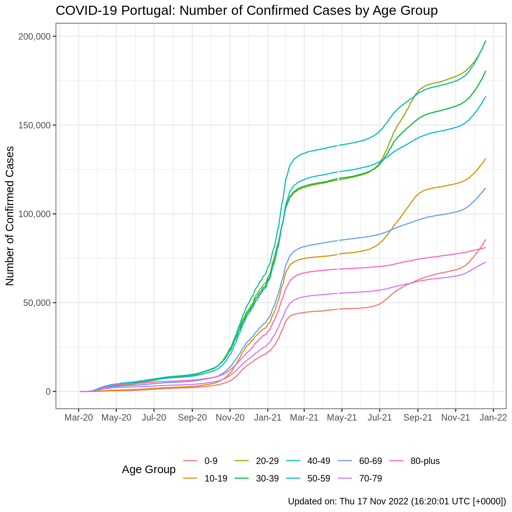

## Daily Portuguese COVID-19 Data

**Last updated: Thu 15 Jul 2021 (03:08:51 UTC \[+0000\])**

  - Data available from **26 Feb 2020** until **14 Jul 2021** (505 days
    - 0 missing).

### Download User Friendly Version

  - Download the user friendly data from:
    **[covid19pt\_DSSG\_Long.csv](https://raw.githubusercontent.com/CEAUL/Dados_COVID-19_PT/master/data/covid19pt_DSSG_Long.csv)**
    or use the following direct link in your program:
      - <https://raw.githubusercontent.com/CEAUL/Dados_COVID-19_PT/master/data/covid19pt_DSSG_Long.csv>
  - **Variables**
      - `data`: Date (Portuguese spelling).
      - `origVars`: Variable name taken from source data.
      - `origType`: Original variable count type.
      - `other`: Other types of `origVars`.
      - `symptoms`: Recorded COVID-19 symptoms.
      - `sex`: Gender (`F` - Females, `M` - Males, `All` - Females &
        Males).
      - `ageGrp`: Age groups in years (`desconhecidos` - unknown).
      - `ageGrpLower`: Lower limit of age group (useful for sorting).
      - `ageGrpUpper`: Upper limit of age group.
      - `region`: Portuguese Regions
      - `value`: Numeric value.
      - `valueUnits`: Units for the variable `value`.

<br>

  - Download the original unprocessed data (json to CSV) from:
    **[covid19pt\_DSSG\_Orig.csv](https://raw.githubusercontent.com/CEAUL/Dados_COVID-19_PT/master/data/covid19pt_DSSG_Orig.csv)**

### Source

For more information about the data and variables see:
**<https://github.com/dssg-pt/covid19pt-data>**

The original data were downloaded from an API provide by VOST
**<https://covid19-api.vost.pt/Requests/get_entry/>**

### Summary: Last 10 (available) Days

|            Date | Cases (7 Day Mean) | Active Cases | Deaths (7 Day Mean) |
| --------------: | -----------------: | -----------: | ------------------: |
| Mon 05 Jul 2021 |      1483 (2160.3) |        38829 |            5 ( 4.4) |
| Tue 06 Jul 2021 |      2170 (2212.3) |        38488 |            1 ( 3.7) |
| Wed 07 Jul 2021 |      3285 (2352.7) |        40258 |            8 ( 4.3) |
| Thu 08 Jul 2021 |      3269 (2469.9) |        41863 |            9 ( 4.9) |
| Fri 09 Jul 2021 |      3194 (2578.1) |        43323 |            7 ( 4.9) |
| Sat 10 Jul 2021 |      3162 (2657.7) |        44006 |            6 ( 5.1) |
| Sun 11 Jul 2021 |      2323 (2698.0) |        45302 |            8 ( 6.3) |
| Mon 12 Jul 2021 |      1782 (2740.7) |        46048 |            8 ( 6.7) |
| Tue 13 Jul 2021 |      2650 (2809.3) |        45199 |            9 ( 7.9) |
| Wed 14 Jul 2021 |      4153 (2933.3) |        47108 |            9 ( 8.0) |


## Example Usage

### Read in the data

Using the `data.table` package to process the data.

``` r
# Load Libraries
library(data.table)
library(here)

# Read in data as a data.frame and data.table object.
CVPT <- fread(here("data", "covid19pt_DSSG_Long.csv"))
# You can use the direct link:
# CV <- fread("https://raw.githubusercontent.com/CEAUL/Dados_COVID-19_PT/master/data/covid19pt_DSSG_Long.csv")

# Looking at the key variables in the original long dataset.
CVPT[, .(data, origVars, origType, sex, ageGrp, region, value, valueUnits)]
##              data   origVars   origType sex ageGrp   region value valueUnits
##     1: 2020-02-26     ativos     ativos All        Portugal    NA           
##     2: 2020-02-27     ativos     ativos All        Portugal    NA           
##     3: 2020-02-28     ativos     ativos All        Portugal    NA           
##     4: 2020-02-29     ativos     ativos All        Portugal    NA           
##     5: 2020-03-01     ativos     ativos All        Portugal    NA           
##    ---                                                                      
## 45951: 2021-07-10 vigilancia vigilancia All        Portugal 72635      Count
## 45952: 2021-07-11 vigilancia vigilancia All        Portugal 73762      Count
## 45953: 2021-07-12 vigilancia vigilancia All        Portugal 74899      Count
## 45954: 2021-07-13 vigilancia vigilancia All        Portugal  1461      Count
## 45955: 2021-07-14 vigilancia vigilancia All        Portugal 77682      Count

# Order data by original variable name and date.
setkeyv(CVPT, c("origVars", "data"))

# Convert data to a data object in dataset and add a change from previous day variable.
# Added a 7 day rolling average for origVars (except for symptoms). 
# Columns `data` is date in Portuguese.
CV <- CVPT[, data := as.Date(data, format = "%Y-%m-%d")][
  , dailyChange := value - shift(value, n=1, fill=NA, type="lag"), by = origVars][
    grepl("^sintomas", origVars), dailyChange := NA][
  , mean7Day := fifelse(origVars %chin% c("ativos", "confirmados", "obitos", "recuperados"), 
                         frollmean(dailyChange, 7), as.numeric(NA))]
```

### Overall Number of Deaths (daily)

``` r
# Change the ggplot theme.
theme_set(theme_bw())
# Data error prevents by sex plot.
# obMF <- CV[origType=="obitos" & sex %chin% c("M", "F") & ageGrp=="" & region == "Portugal"]
obAll <- CV[origType=="obitos" & sex %chin% c("All") & ageGrp=="" & region == "Portugal"][ 
  , sex := NA]

obAll %>% 
  ggplot(aes(x = data, y = dailyChange)) +
  geom_bar(stat = "identity", fill = "grey75") +
  geom_line(data = obAll, aes(x = data, y = mean7Day), group=1, colour = "brown") +
  scale_x_date(date_breaks = "2 months",
               date_labels = "%b-%y",
               limits = c(min(cvwd$data2, na.rm = TRUE), NA)) +
  scale_y_continuous(breaks = seq(0, max(obAll[, dailyChange], na.rm = TRUE) + 50, 50)) +
  theme(legend.position = "bottom") +
  labs(
    title = "COVID-19 Portugal: Number Daily Deaths with 7 Day Rolling Mean",
    x = "",
    y = "Number of Deaths",
    colour = "",
    fill = "",
    caption = paste0("Updated on: ", format(Sys.time(), "%a %d %b %Y (%H:%M:%S %Z [%z])"))
    )
## Warning: Removed 1 rows containing missing values (position_stack).
## Warning: Removed 7 row(s) containing missing values (geom_path).
```


### Recorded Number of Confirmed COVID-19 Cases by Age Group

``` r
CV[origType=="confirmados" & !(ageGrp %chin% c("", "desconhecidos"))][
  , .(valueFM = sum(value)), .(data, ageGrp)] %>%
  ggplot(., aes(x=data, y=valueFM, colour = ageGrp)) +
  geom_line() +
  scale_x_date(date_breaks = "2 months",
               date_labels = "%b-%y",
               limits = c(min(cvwd$data2, na.rm = TRUE), NA)) +
  scale_y_continuous(labels = scales::number_format(big.mark = ",")) +
  theme(legend.position = "bottom") +
  labs(
    title = "COVID-19 Portugal: Number of Confirmed Cases by Age Group",
    x = "",
    y = "Number of Confirmed Cases",
    caption = paste0("Updated on: ", format(Sys.time(), "%a %d %b %Y (%H:%M:%S %Z [%z])")),
    colour = "Age Group")
## Warning: Removed 54 row(s) containing missing values (geom_path).
```



### Recorded Number of Confirmed COVID-19 Cases by Region

``` r
CV[origType=="confirmados" & ageGrp=="" & region!="Portugal"] %>%
  ggplot(., aes(x=data, y=value, colour=region)) +
  geom_line() +
  scale_x_date(date_breaks = "2 months",
               date_labels = "%b-%y",
               limits = c(min(cvwd$data2, na.rm = TRUE), NA)) +
  scale_y_log10(labels = scales::number_format(big.mark = ",")) +
  theme(legend.position = "bottom") +
  labs(
    title = "COVID-19 Portugal: Number of Confirmed Cases by Region",
    x = "",
    y = "Number of Confirmed Cases",
    caption = paste0("Updated on: ", format(Sys.time(), "%a %d %b %Y (%H:%M:%S %Z [%z])")),
    colour = "Region")
## Warning: Transformation introduced infinite values in continuous y-axis
## Warning: Removed 489 row(s) containing missing values (geom_path).
```


<hr>

## Issues & Notes

### Use and interpret with care.

The data are provided as is. Any quality issues or errors in the source
data will be reflected in the user friend data.

Please **create an issue** to discuss any errors, issues, requests or
improvements.

### Calculated change between days can be negative (`dailyChange`).

``` r
CV[dailyChange<0 & !(origType %in% c("vigilancia", "internados"))][
  , .(data, origType, origVars, value, dailyChange)]
##            data    origType              origVars    value dailyChange
##   1: 2020-05-12      ativos                ativos 23737.00     -249.00
##   2: 2020-05-16      ativos                ativos 23785.00     -280.00
##   3: 2020-05-17      ativos                ativos 23182.00     -603.00
##   4: 2020-05-18      ativos                ativos 21548.00    -1634.00
##   5: 2020-05-22      ativos                ativos 21321.00     -862.00
##  ---                                                                  
## 717: 2021-06-28          rt           rt_nacional     1.13       -0.01
## 718: 2021-07-09          rt           rt_nacional     1.18       -0.02
## 719: 2021-07-12          rt           rt_nacional     1.16       -0.02
## 720: 2021-07-14          rt           rt_nacional     1.14       -0.02
## 721: 2020-05-21 transmissao transmissao_importada   767.00       -3.00
```
